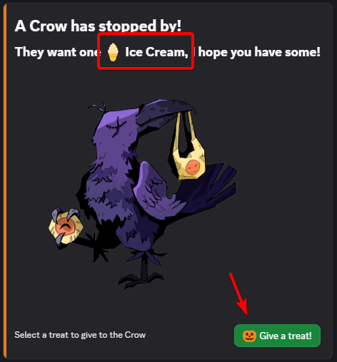
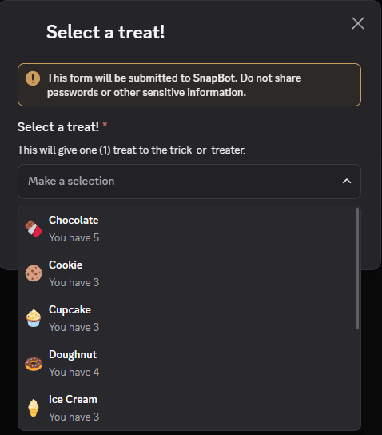
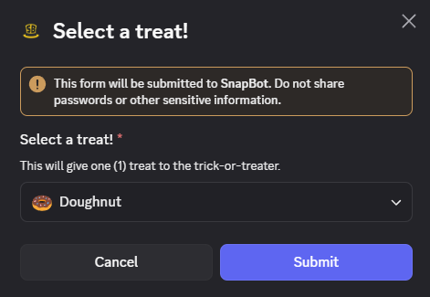

# Halloween Cog

The assets used in the Cog were taken form the Trick'cord Treat event that Discord hosted in 2020. The original link has been removed, so here's an archived version:
https://web.archive.org/web/20201031021358/https://support.discord.com/hc/en-us/articles/360057167253-Halloween-Bot-2020

So thanks to whoever made the art, they are really awesome, and made this possible!

## Event Description

This is a timely event that will happen a few weeks before Halloween, and end a few days after.
During that time, you will be able to collect **treats** that appear randomly under your messages as you chat with the community.
On top of **treats** to collect, there will be **trick-or-treaters** that will spawn in a special channel, asking for specific **treats**!
It is up to YOU to give them what they are looking for, in exchange for a special collectible **loot** item!
This **loot** ranges from **common** trinkets such as the **Goblin**'s **Lucky Rock**, to some very **rare** ones, like the **Alien**'s **Levitation Belt**!
If you don't give them what they want though, either because you don't have the **treat** or because you feel mischievous, who knows what might happen!

You will have access to some event related commands all under the **``/halloween``** "main" command.
For example, to check how many treats you have, use the **``/halloween treats``** command.
More on them later!

## Detailed Explanation

Now for some more detailed explanations on the different parts of the event:

### Treats

**Treats** will spawn randomly under your messages, in the form of a **reaction** added by @HatBot.
Then tap the reaction yourself to **collect** the **treat** in your inventory.
Simple as that!
Do not worry about other people stealing your hard earned **treats**, only *you* can claim the **treats** under your messages.
There is no time limit either, so if you miss it, it will be there later.

There **treats** will be useful to give to [trick-or-treaters](#trick-or-treaters) later.

You can view your **treats** inventory with the command **``/halloween treats``** to get the amount of each you currently have.
There is also a button to check your stash in an "exploded" view, just for fun 👀!

### Trick-or-treaters

The **trick-or-treaters** will spawn in the designated channel somewhat randomly.
The mechanics is: at each message sent in the channel, it tests randomly if it spawns a **trick-or-treater**.
This test is increasingly more probable with time.
For example, at first it spawns with a 0% chance (i.e. will never spawn), but as time passes, it gets much more likely (100% chance to spawn on a message after 30 minutes).
There is also a few minutes cooldown after a **trick-or-treater** spawn, so that there is always only one active at a time.

Once the **trick-or-treater** is spawned, it will remain active for a short time (a few minutes).
They will request a specific **treat**, which you can give them with the **🎃 Give a treat!** button.

A drop-down menu will pop and you can select which **treat** to give out.

Confirm by clicking the **Submit** button.

The layout might look a bit different on mobile, but the mechanics are exactly the same.

If you give the **treat** that has been requested by the **trick-or-treater**, great!
You get a random [**loot** item](#loot) from them.
But what if, like in the example above, you *do not* give them what they want...?

### Blessing

In the event where you do not give the **trick-or-treater** the **treat** they want, you have a 50% chance of them liking it even more!
In this case, they are happy and **bless** you, so you get a **loot** item with increased rarity, as well as a bonus **treat**!
How nice of them!

### Curse!

In the event where you do not give the **trick-or-treater** the **treat** they want, you have a 50% chance of them not liking it at all!
In this case, they are angry and **curse** you, so forget about the **loot**!
When **Cursed**, you get a silly random nickname, with a Halloween theme, as well as a special coloured role, so people can see that you are mischievous!
Don't worry, the **curse** only lasts about 15 minutes, and will disperse by itself.

### Loot!

You can check the loot you have gained with the command **``/halloween loot``**.
It will show as a table, with the level of completion at the bottom.
Try to get as many unique items as possible!

### Command List

| Command               | Description                            |
| --------------------- | -------------------------------------- |
| ``/halloween treats`` | See the treats you have collected.     |
| ``/halloween loot``   | See the loot items you have collected. |

### FAQ

Q: How do I get **treats**?

A: Just send messages in any channel (while respecting the community's rules), and treats will randomly appear under your messages.

Q: Are the frequency of the **trick-or-treaters** based on chat activity?

A: No, the frequency is random, with increasing probabilities as time passes, which resets at spawn. However, a message needs to be sent to trigger a **trick-or-treater** spawn.

Q: How long does this event last?

A: Probably two weeks, but it might last longer if it is appreciated!

Q: How many unique **loot** items are there?

A: 120 unique **loot** items! However, the **trick-or-treaters** may drop duplicate items!
